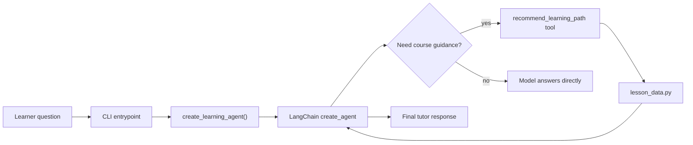

# LangChain `create_agent` Example

A tiny, testable Python project that demonstrates LangChain's `create_agent`
API with an OpenAI model and a local Python tool.

The example is intentionally small: the agent can call one deterministic
learning-path tool, then explain the result conversationally.

## How it works



## What this teaches

- how to define a LangChain tool with `@tool`
- how to create an agent with `create_agent`
- how to pass chat messages into `agent.invoke(...)`
- how to keep non-LLM logic easy to test

## Requirements

- Python 3.10+
- an OpenAI API key

## Setup

```bash
python -m venv .venv
source .venv/bin/activate
python -m pip install -e ".[dev]"
cp .env.example .env
```

Then edit `.env` and add your OpenAI API key:

```bash
OPENAI_API_KEY=your-api-key
```

## Run the example

```bash
python -m langchain_create_agent_example "What should I learn first for LangChain agents?"
```

You can override the model with `LANGCHAIN_MODEL`:

```bash
LANGCHAIN_MODEL=openai:gpt-4o-mini python -m langchain_create_agent_example "How do tools fit into agents?"
```

## Run tests

```bash
python -m pytest
```

The tests cover deterministic helper behavior only. They do not call OpenAI or
require an API key.

## Key file

The main example lives in:

```text
src/langchain_create_agent_example/agent.py
```

The core LangChain shape is:

```python
agent = create_agent(
    model=model,
    tools=[recommend_learning_path],
    system_prompt=SYSTEM_PROMPT,
)

result = agent.invoke(
    {"messages": [{"role": "user", "content": question}]}
)
```
